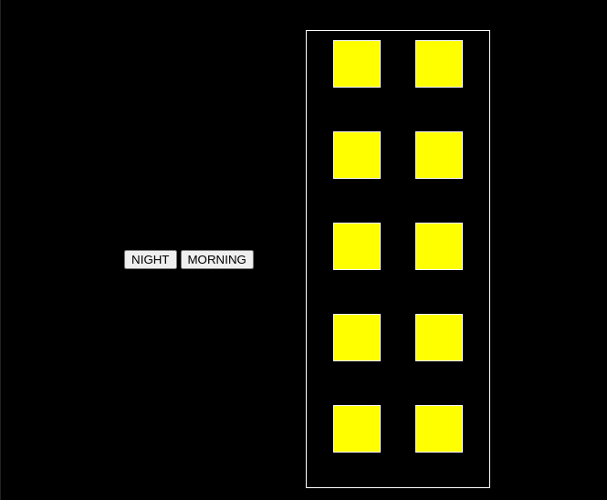
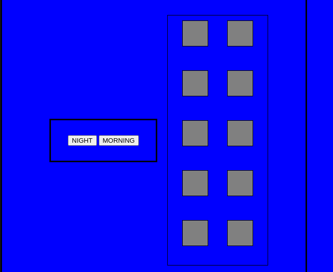

# Projeto-Curso-de-javascript-exercicio-one
Este projeto em JavaScript visa criar um sistema que simula a transição entre os modos "dia" e "noite" em uma página web. Isso será alcançado alterando dinamicamente o tema da página, ajustando cores, imagens e outros elementos visuais.

